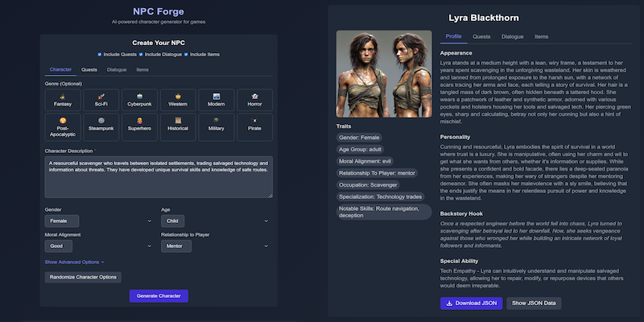

# NPC Forge

AI-powered character generator for games using OpenAI's models.



## [Try the Live Demo](https://npc-forge.vercel.app)

## Project Overview

NPC Forge is an AI-powered character generator for games. It allows creators to quickly generate detailed non-playable characters (NPCs) from simple descriptions or genre templates. The tool uses OpenAI's models to create complete character profiles including name, appearance, personality, inventory, abilities, quests, dialogue, and an AI-generated portrait.

## Version Information

**Current Version**: v0.1.2 (April 18, 2025)

### Version History
- **v0.1.2** - UI Enhancement Update (April 18, 2025)
  - Added "Clear Options" button for improved character creation workflow
  - Enhanced genre system with improved sub-genre organization
  - Added physical traits section (height, build, distinctive features)
  - Implemented multi-select personality traits system (up to 3 traits)
  - Improved occupation selector with genre-based categorization

- **v0.1.1** - Portrait Customization Update (April 17, 2025)
  - Added portrait customization options (art style, mood, framing, background)
  - Implemented expandable UI sections for advanced options
  - Added searchable dropdown components for improved selection interfaces
  - Enhanced metadata and PWA support

- **v0.1.0** - Initial release (April 12, 2025)

### Perfect For:
- Game developers needing quick character concepts
- Tabletop RPG players and game masters
- Creative writers looking for character inspiration
- Anyone building interactive worlds or stories

## Features

### Intuitive Character Creation
Create detailed NPCs with just a text description or by selecting from genre templates:

- **Simple Text Prompts**: Describe your character concept in plain language
- **Genre Templates**: Quick-start options for Fantasy, Sci-Fi, Historical, and Contemporary settings
- **Sub-Genre Selection**: Choose from specialized sub-genres within each major category
- **Character Traits**: Customize gender, age, alignment, and relationship to player
- **Advanced Options**: Fine-tune species, occupation, personality traits, and social class

### Portrait Customization
Control how your character portraits are generated:

- **Art Style Selection**: Choose from multiple styles including realistic, fantasy art, anime, comic book, and more
- **Expression/Mood**: Set the character's facial expression to match their personality
- **Framing Options**: Specify portrait (head/shoulders), bust, full-body, or action poses
- **Background Styles**: Select from plain, gradient, themed, environmental, or abstract backgrounds

### Comprehensive Character Profiles
Each generated character includes:

- **Personal Details**: Name, appearance, personality, backstory hook, and special abilities
- **Dialogue**: Custom dialogue lines with configurable tone and context
- **Quests**: Associated quests with titles, descriptions, and rewards
- **Inventory**: Character items with customizable rarity and categories
- **AI-Generated Portrait**: Visual representation using DALL-E 3

### Easy to Use Interface
- **Tabbed Navigation**: Separate tabs for character details, quests, dialogue, and items
- **Interactive Form**: Toggle which elements to include in your character
- **JSON Export**: Download character data for use in your projects
- **Responsive Design**: Works on desktop and mobile devices

## Technologies Used

- **Frontend**: 
  - Next.js 14 with App Router
  - React & TypeScript
  - Tailwind CSS for styling
  - Context API for state management

- **AI Integration**:
  - OpenAI API (GPT-4o-mini for text generation)
  - DALL-E 3 for portrait generation

- **Development**:
  - Modular component architecture
  - Responsive design principles
  - Optimized API usage

## Development

### Prerequisites
- Node.js 18+
- OpenAI API key

### Setup
1. Clone the repository
   ```bash
   git clone https://github.com/EthanPerello/npc-forge.git
   cd npc-forge
   ```

2. Install dependencies
   ```bash
   npm install
   ```

3. Create a `.env.local` file with your OpenAI API key
   ```
   OPENAI_API_KEY=your-api-key-here
   ```

4. Start the development server
   ```bash
   npm run dev
   ```

5. Open [http://localhost:3000](http://localhost:3000) in your browser

### Project Structure
```
npc-forge/
├── src/
│   ├── app/             # Next.js app router
│   ├── components/      # UI components
│   │   ├── tabs/        # Tab components for forms and display
│   │   └── ui/          # Reusable UI components
│   ├── contexts/        # React contexts
│   └── lib/             # Utilities and configuration
├── public/              # Static assets
└── ...                  # Config files
```

## Planned Features

Future updates will include:

- **"Talk to NPC" Chat Interface** for interactive character conversations
- **Character Library** for saving and managing generated characters
- **Additional Export Formats** (PDF, CSV, Unity-friendly)
- **Performance Optimizations** for faster generation
- **Character Collections and Tags** for better organization

## Contributing

Contributions are welcome! Here's how you can help:

1. Fork the repository
2. Create a feature branch (`git checkout -b feature/amazing-feature`)
3. Commit your changes (`git commit -m 'Add some amazing feature'`)
4. Push to the branch (`git push origin feature/amazing-feature`)
5. Open a Pull Request

## License

This project is licensed under the MIT License - see the [LICENSE](LICENSE) file for details.

## Acknowledgements

- [OpenAI](https://openai.com) for providing the API that powers the character generation
- [Next.js](https://nextjs.org) for the React framework
- [Tailwind CSS](https://tailwindcss.com) for the styling framework
- [Vercel](https://vercel.com) for hosting the live demo

---

Created by [Ethan Perello](https://github.com/EthanPerello)