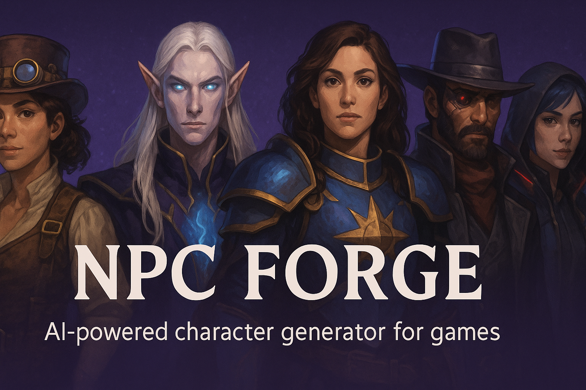

# NPC Forge



NPC Forge is an AI-powered character generator for games, tabletop RPGs, and storytelling. Create detailed NPCs with personalities, quests, dialogue, items, and AI-generated portraits.

[](https://github.com/EthanPerello/npc-forge/releases)
[](LICENSE)
[](https://nextjs.org/)
[](https://openai.com/)

## 🚀 Live Demo

Try NPC Forge live at: [https://npc-forge-ethan-perellos-projects.vercel.app/](https://npc-forge-ethan-perellos-projects.vercel.app/)

## ✨ Features

- **Wizard-Based Character Creation**: Step-by-step guided process with progress tracking
- **Character Library**: Save, manage, edit, and organize your NPCs
- **AI-Powered Generation**: Create detailed NPCs from descriptions
- **Multiple AI Models**: Choose from Standard, Enhanced, and Premium tiers
- **Character Regeneration**: Regenerate individual character attributes and portraits
- **AI Portraits**: Generate character portraits with customizable styles
- **Complete Character Profiles**: Appearance, personality, backstory, quests, dialogue, and items
- **Advanced Filtering**: Search and filter characters by traits
- **Enhanced Documentation**: Comprehensive guides and examples with automatic content loading
- **Import/Export**: JSON import/export for character data
- **Dark Mode**: Full dark mode support
- **Responsive Design**: Works on desktop and mobile

## 🔄 New in v0.19.0: Documentation System Overhaul

- **Automatic Documentation Loading**: Content loads directly from markdown files for easier maintenance
- **Enhanced Visual Hierarchy**: Improved styling and organization throughout all documentation
- **Smart Content Grouping**: Related information automatically grouped for better readability
- **Cross-Reference Navigation**: Added "Related Documentation" sections across all guides
- **Professional Appearance**: Cleaner, more consistent styling across all pages

## 🛠️ Installation & Development

### Prerequisites

- Node.js 18+
- OpenAI API key

### Setup

1. Clone the repository:
   ```bash
   git clone https://github.com/EthanPerello/npc-forge.git
   cd npc-forge
   ```

2. Install dependencies:
   ```bash
   npm install
   ```

3. Create a `.env.local` file:
   ```
   OPENAI_API_KEY=your-api-key-here
   ```

4. Start the development server:
   ```bash
   npm run dev
   ```

## 🔧 Model Selection

| Tier | Text Model | Image Model | Monthly Limit |
|------|------------|-------------|---------------|
| 🟢 Standard | gpt-4o-mini | dall-e-2 | 50 text / 10 images |
| 🟡 Enhanced | gpt-4.1-mini | dall-e-3 | 30 text / 5 images |
| 🔴 Premium | gpt-4o | gpt-image-1 | 10 text / 3 images |

## 📖 Documentation

Comprehensive documentation is available at `/docs` including:

- **[How to Use](/docs/how-to-use)** - Complete user guide
- **[Character Examples](/docs/character-examples)** - Sample characters and use cases  
- **[Character Library](/docs/library)** - Library management and filtering
- **[Model Selection](/docs/models)** - Understanding AI model tiers
- **[Generation Options](/docs/generation-options)** - Detailed customization guide
- **[Features Overview](/docs/features)** - Complete feature list
- **[API Documentation](/docs/api)** - Technical API reference
- **[Development Setup](/docs/dev-setup)** - Local development guide
- **[Contributing](/docs/contributing)** - How to contribute
- **[FAQ](/docs/faq)** - Frequently asked questions

## 📜 License

This project is licensed under the MIT License - see the [LICENSE](LICENSE) file for details.

## 👏 Credits

- Created by [Ethan Perello](https://github.com/EthanPerello)
- Character generation powered by [OpenAI API](https://openai.com/)
- Built with [Next.js](https://nextjs.org/) and [Tailwind CSS](https://tailwindcss.com/)
- Icons by [Lucide](https://lucide.dev/)

## 🤝 Contributing

For bug reports, feature requests, or questions, please [open an issue](https://github.com/EthanPerello/npc-forge/issues).

For development contributions, see our [Contributing Guide](/docs/contributing).

## 📞 Contact

For questions or feedback, contact Ethan Perello at [ethanperello@gmail.com](mailto:ethanperello@gmail.com).