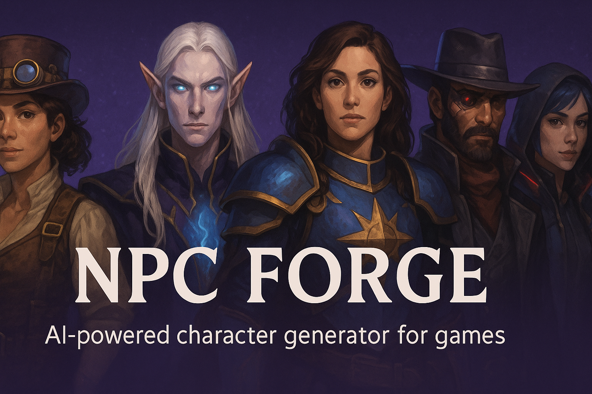

# NPC Forge



**AI-powered character generator for games, tabletop RPGs, and storytelling.** Create detailed NPCs with personalities, quests, dialogue, items, and portraits. Chat with your characters and edit their portraits using AI.

[](https://github.com/EthanPerello/npc-forge/releases)
[](LICENSE)
[](https://nextjs.org/)

## 🎮 [Try It Now - Completely Free!](https://npc-forge.vercel.app)

## ✨ Key Features

- **🤖 AI Character Generation** - Detailed NPCs with unique personalities and backgrounds
- **💬 Interactive Chat** - Have conversations with your generated characters  
- **🎨 Portrait Editing** - Edit character portraits with AI-powered text prompts
- **📚 Character Library** - Store, organize, and filter your character collection
- **⚙️ Multiple AI Models** - Choose from Standard, Enhanced, and Premium quality tiers
- **📱 Responsive Design** - Works seamlessly on desktop and mobile
- **🔒 Privacy First** - All data stored locally in your browser

## 🚀 Quick Start

### For Users
**No setup required!** Visit [npc-forge.vercel.app](https://npc-forge.vercel.app) and start creating characters immediately.

### For Developers
```bash
# Clone and install
git clone https://github.com/EthanPerello/npc-forge.git
cd npc-forge
npm install

# Add your OpenAI API key
echo "OPENAI_API_KEY=your-api-key-here" > .env.local

# Start development server
npm run dev
```

## 📖 Documentation

| Guide | Description |
|-------|-------------|
| [How to Use](/docs/how-to-use) | Complete user guide with step-by-step instructions |
| [Character Examples](/docs/character-examples) | Sample characters showcasing different genres and styles |
| [Chat with Characters](/docs/chat) | Interactive conversation guide and best practices |
| [Model Selection](/docs/models) | Understanding AI model tiers and usage limits |
| [Character Library](/docs/library) | Managing and organizing your character collection |
| [API Documentation](/docs/api) | Technical reference for developers |
| [FAQ](/docs/faq) | Frequently asked questions and troubleshooting |

## 🎯 Perfect For

- **Game Masters** - Create compelling NPCs for tabletop RPGs
- **Game Developers** - Generate characters for video games and interactive fiction  
- **Writers** - Develop characters for stories and novels
- **Content Creators** - Generate characters for streaming and media

## 🆓 Free & Open Source

NPC Forge is completely free to use with no accounts, subscriptions, or hidden costs. Built-in usage limits ensure fair access for all users while providing generous monthly allowances.

## 🛠️ Built With

- [Next.js 15](https://nextjs.org/) - React framework
- [OpenAI API](https://openai.com/) - AI generation
- [Tailwind CSS](https://tailwindcss.com/) - Styling
- [TypeScript](https://www.typescriptlang.org/) - Type safety

## 🤝 Contributing

Contributions are welcome! Please see our [Contributing Guide](/docs/contributing) for details.

**For Contributors:** Local development requires an OpenAI API key and charges against your personal account.

## 📄 License

This project is licensed under the MIT License - see the [LICENSE](LICENSE) file for details.

## 👨‍💻 Creator

Created by [Ethan Perello](https://github.com/EthanPerello) • [ethanperello@gmail.com](mailto:ethanperello@gmail.com)

---

**⭐ Star this project if you find it useful!**